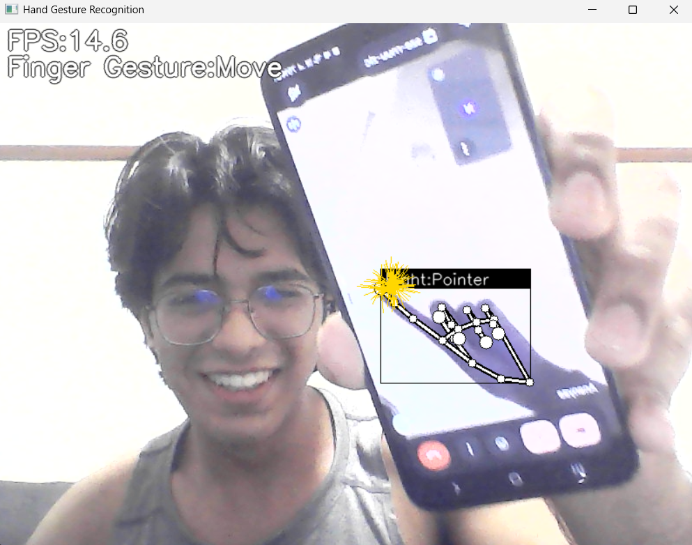

# Sparkly Fingers
This is a sample program that recognizes hand signs and finger gestures with a simple MLP using the detected key points.
<br> ❗ _️**My project draws significant inspiration from [the following repository](https://github.com/Kazuhito00/hand-gesture-recognition-using-mediapipe). Many portions of the code have been adapted and rephrased based on implementation.**_ ❗
<br> 


<b>A few days ago, I discovered mediapipe and decided to do a project on it.<br>
I was was having a chat about it with my girlfriend, and she asked if I can make sparkles come out of her finger when she points it to the camera.<br>
Being a good coder boyfriend, I managed to learn and make it work in a few days.</b>


# Requirements
* mediapipe 0.8.1
* OpenCV 3.4.2 or Later
* Tensorflow 2.3.0 or Later<br>tf-nightly 2.5.0.dev or later (Only when creating a TFLite for an LSTM model)
* scikit-learn 0.23.2 or Later (Only if you want to display the confusion matrix) 
* matplotlib 3.3.2 or Later (Only if you want to display the confusion matrix)

# Demo
Here's how to run the demo using your webcam.
```bash 
python sparkly_fingers.py
```

The following options can be specified when running the demo.
* --device<br>Specifying the camera device number (Default：0)
* --width<br>Width at the time of camera capture (Default：960)
* --height<br>Height at the time of camera capture (Default：540)
* --use_static_image_mode<br>Whether to use static_image_mode option for MediaPipe inference (Default：Unspecified)
* --min_detection_confidence<br>
Detection confidence threshold (Default：0.5)
* --min_tracking_confidence<br>
Tracking confidence threshold (Default：0.5)

# Directory
<pre>
│  sparkly_fingers.py
│  keypoint_classification.ipynb
│  point_history_classification.ipynb
│  
├─model
│  ├─keypoint_classifier
│  │  │  keypoint.csv
│  │  │  keypoint_classifier.hdf5
│  │  │  keypoint_classifier.py
│  │  │  keypoint_classifier.tflite
│  │  └─ keypoint_classifier_label.csv
│  │          
│  └─point_history_classifier
│      │  point_history.csv
│      │  point_history_classifier.hdf5
│      │  point_history_classifier.py
│      │  point_history_classifier.tflite
│      └─ point_history_classifier_label.csv
│          
└─utils
    └─cvfpscalc.py
</pre>

# Reference
* [MediaPipe](https://mediapipe.dev/)

# License 
hand-gesture-recognition-using-mediapipe is under [Apache v2 license](LICENSE).

